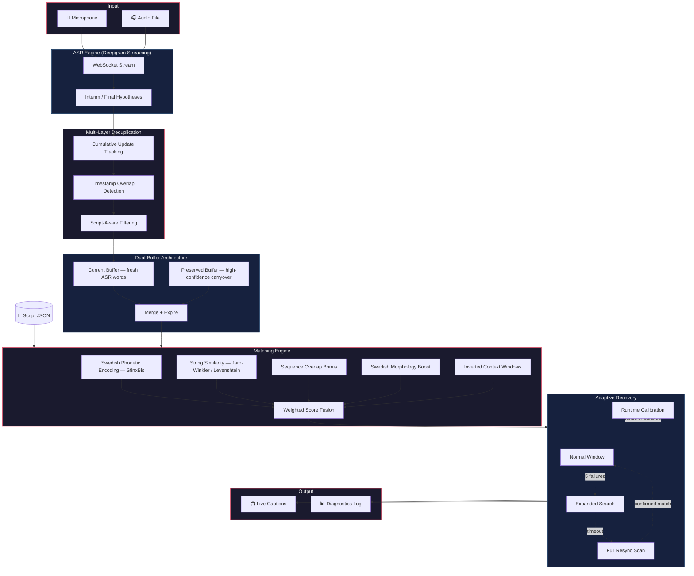

# ScriptSync — Real-Time Speech-to-Script Alignment

Automatic real-time captioning for live performance is an unsolved accessibility problem. Pre-timed subtitles fail the moment an actor pauses, ad-libs, or skips a line. ScriptSync solves this by listening to what's actually being said and matching it against the script as it happens — delivering accurate, perfectly timed captions that follow the performance.

The system streams audio through cloud ASR, deduplicates and buffers the results, then scores candidates against a preloaded script using a fusion of Swedish phonetic encoding, string similarity, and morphological analysis. An adaptive recovery pipeline handles lost position, skipped lines, and noisy audio without manual intervention.

Built in Python. Optimized for Swedish. Designed for theater and dubbed broadcast.

---

## Architecture Overview




---

## Key Design Decisions

### Swedish-First Matching Pipeline

Standard edit-distance isn't enough for Swedish. The matching engine combines **three complementary signals**:


| Signal                              | Purpose                                                                                                                                               |
| ----------------------------------- | ----------------------------------------------------------------------------------------------------------------------------------------------------- |
| **SfinxBis phonetic encoding**      | Native Swedish phonetic algorithm — handles å, ä, ö and Swedish pronunciation rules that generic phonetic encoders (Soundex, Metaphone) miss entirely |
| **Jaro-Winkler / Levenshtein**      | Character-level similarity with configurable scaling to handle OCR artifacts and ASR transcription errors                                             |
| **Morphological variant detection** | Recognizes that *"barnen"* and *"barn"*, or *"sade"* and *"säga"*, are the same word through Stanza-based lemmatization                               |


These signals are fused with configurable weights and augmented by a **sequence overlap bonus** that rewards words appearing in the correct order.

### Inverted Context Windows

Short dialogue lines (1–3 words) are notoriously hard to match — not enough signal in the words themselves. Counter-intuitively, the system gives short lines **larger** context windows, pulling words from surrounding script lines to create a unique fingerprint. Target and context words are weighted separately per word-count bracket.

### Three-Layer Deduplication

Streaming ASR produces cumulative, overlapping results that must be deduplicated before matching. The pipeline uses three specialized layers:

1. **Cumulative tracking** — identifies genuinely new words from Deepgram's rolling updates
2. **Timestamp overlap detection** — catches repeated words from utterance boundary effects
3. **Script-aware filtering** — uses script context to distinguish true repeats from legitimate repeated dialogue

### Dual-Buffer Word Accumulation

Rather than a single FIFO, the system maintains two buffers:

- **Current buffer** — fresh ASR words awaiting their first match attempt
- **Preserved buffer** — high-confidence words from partial matches, carried forward with expiration tracking

This prevents the common failure mode where a partial match discards words that belong to a skipped line.

### Adaptive Recovery Escalation

When the system loses track of position (actor skips lines, background noise), it escalates through progressively wider search modes:

```
Normal (2 lines ahead) → Expanded (4 lines) → Full Resync (50 lines)
```

A **runtime calibration** phase during the first N matches profiles the audio difficulty and automatically tunes recovery thresholds for the rest of the run.

---

## System Design

```
script_sync.py                    ← CLI orchestrator + runtime loop
│
├── modules/
│   ├── config_manager.py         ← YAML config → typed dataclasses
│   ├── script_loader.py          ← Script JSON → preprocessed ScriptLines
│   ├── audio_input.py            ← Mic/file → resampled audio chunks
│   ├── deepgram_asr.py           ← Streaming ASR + internal dedup
│   ├── script_aware_deduplicator ← Script-context dedup layer
│   ├── dual_word_buffer.py       ← Dual-buffer accumulation
│   ├── matching_engine.py        ← Multi-signal scoring engine
│   ├── swedish_normalization.py  ← Morphological variant handling
│   ├── name_masker.py            ← NER-based proper name masking
│   └── output_handler.py         ← Captions + diagnostic logging
│
├── configs/
│   └── default_config.yaml       ← Full config with documented defaults
│
└── utils/
    └── screenplay_extractor.py   ← PDF/text → structured screenplay JSON
```

Each module follows **dependency injection** (logger, config passed at construction) and exposes a narrow public API. The orchestrator in `script_sync.py` owns all mutable state and coordinates the pipeline.

---

## Content Pipeline

Scripts don't arrive as clean JSON. The project includes a **screenplay extraction pipeline** that converts raw PDFs and text files into structured, matchable JSON:


- **Spatial classification** uses bounding-box geometry from hi-res OCR to distinguish dialogue, stage directions, scene headings, and character names
- **Text classification** provides a fallback for non-PDF inputs using heuristic pattern matching
- Optional **LLM post-processing** corrects OCR artifacts in extracted dialogue

---

## Technical Highlights

- **Streaming-first** — processes audio in real time via WebSocket, not batch
- **Configurable similarity metric** — swap between Jaro-Winkler and Levenshtein with a single config flag; Jaro-Winkler uses power-law scaling to match edit-distance score distributions
- **Name-aware matching** — NER-detected proper names receive fixed similarity scores (names are unpredictable in ASR) with configurable caps per candidate
- **Runtime invariant checking** — optional contract tests verify buffer synchronization and position tracking during development
- **Diagnostic taxonomy** — failed matches are classified by failure cause for systematic debugging
- **Testing mode** — run multiple config profiles against the same audio to A/B test parameter changes

---

## Tech Stack


| Layer          | Technology                              |
| -------------- | --------------------------------------- |
| Language       | Python 3.12                             |
| ASR            | Deepgram Nova-3 (streaming WebSocket)   |
| Phonetics      | SfinxBis via abydos                     |
| NLP            | Stanza (lemmatization + NER)            |
| Similarity     | python-Levenshtein, custom Jaro-Winkler |
| PDF Extraction | Unstructured API, pypdf, Tesseract OCR  |
| Translation    | DeepL API                               |
| Audio I/O      | sounddevice, scipy                      |
| Config         | YAML → dataclass validation             |


---

## Status

Active development. Built as part of an accessibility initiative to bring real-time captioning to Swedish-language theater and dubbed media.

---

Built by Dahni Strauss at [Accessible Futures AB](https://accessiblefutures.se).
