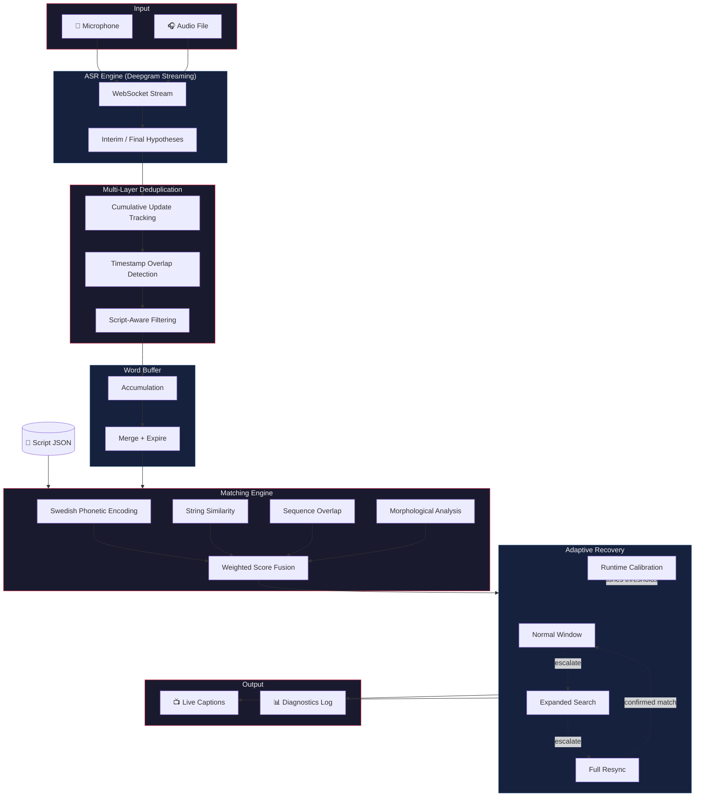

# ScriptSync — Real-Time Speech-to-Script Alignment

Automatic real-time captioning for live performance is an unsolved accessibility problem. Pre-timed subtitles fail the moment an actor pauses, ad-libs, or skips a line. ScriptSync solves this by listening to what's actually being said and matching it against the script as it happens — delivering accurate, perfectly timed captions that follow the performance.

The system streams audio through cloud ASR, deduplicates and buffers the transcript, then scores candidates against a preloaded script using a fusion of Swedish phonetic encoding, string similarity, and morphological analysis. An adaptive recovery pipeline handles lost position, skipped lines, and noisy audio without manual intervention.

Built in Python. Optimized for Swedish. Designed for theater and dubbed broadcast.

---

## Architecture Overview



---

## Key Design Challenges

### Swedish-First Matching

Standard edit-distance isn't enough for Swedish. The matching engine combines three complementary signals — phonetic encoding, character-level similarity, and morphological analysis — because no single metric handles the full range of ASR transcription errors, OCR artifacts, and Swedish inflectional variation. Signals are fused with configurable weights and augmented by a sequence overlap bonus that rewards words appearing in the correct order.

### Short-Line Disambiguation

Short dialogue lines (1–3 words) are notoriously hard to match in isolation — there isn't enough signal in the words themselves. The system handles this through context-aware scoring that draws on surrounding script content to create a more distinctive fingerprint, with target and context words weighted separately.

### Streaming ASR Deduplication

Streaming ASR produces cumulative, overlapping hypotheses that create noise before matching. The pipeline addresses this with multiple specialized deduplication layers, including one that uses script context to correctly distinguish ASR artifacts from legitimately repeated dialogue.

### Position Recovery

When the system loses track of position — actor skips lines, background noise disrupts the match — it escalates through progressively wider search windows before falling back to a full rescan. A runtime calibration phase at the start of each session profiles audio conditions and tunes recovery thresholds automatically.

---

## System Design

```
script_sync.py                    ← CLI orchestrator + runtime loop
│
├── modules/
│   ├── config_manager.py         ← YAML config → typed dataclasses
│   ├── script_loader.py          ← Script JSON → preprocessed ScriptLines
│   ├── audio_input.py            ← Mic/file → resampled audio chunks
│   ├── deepgram_asr.py           ← Streaming ASR + internal dedup
│   ├── script_aware_deduplicator ← Script-context dedup layer
│   ├── word_buffer.py            ← Word accumulation + expiration
│   ├── matching_engine.py        ← Multi-signal scoring engine
│   ├── swedish_normalization.py  ← Morphological variant handling
│   ├── name_masker.py            ← Proper name handling for ASR
│   └── output_handler.py         ← Captions + diagnostic logging
│
├── configs/
│   └── default_config.yaml       ← Full config with documented defaults
│
└── utils/
    └── screenplay_extractor.py   ← PDF/text → structured screenplay JSON
```

Each module follows dependency injection and exposes a narrow public API. The orchestrator owns all mutable state and coordinates the pipeline.

---

## Content Pipeline

Scripts don't arrive as clean JSON. The project includes a screenplay extraction pipeline that converts raw PDFs and text files into structured, matchable JSON:


- **Spatial classification** uses bounding-box geometry from OCR to distinguish dialogue, stage directions, scene headings, and character names
- **Text classification** provides a fallback for non-PDF inputs
- Optional **LLM post-processing** corrects OCR artifacts in extracted dialogue

---

## Technical Highlights

- **Streaming-first** — processes audio in real time via WebSocket, not batch
- **Configurable similarity metric** — swap between Jaro-Winkler and Levenshtein with a single config flag
- **Name-aware matching** — proper names receive special handling, since ASR transcription of names is inherently unpredictable
- **Runtime invariant checking** — optional contract tests verify internal state consistency during development
- **Diagnostic taxonomy** — failed matches are classified by failure cause for systematic debugging
- **Testing mode** — run multiple config profiles against the same audio to A/B test parameter changes

---

## Tech Stack

| Layer | Technology |
|---|---|
| Language | Python 3.12 |
| ASR | Deepgram Nova-3 (streaming WebSocket) |
| Phonetics | SfinxBis via abydos |
| NLP | Stanza (lemmatization + NER) |
| Similarity | python-Levenshtein, Jaro-Winkler |
| PDF Extraction | Unstructured API, pypdf, Tesseract OCR |
| Translation | DeepL API |
| Audio I/O | sounddevice, scipy |
| Config | YAML → dataclass validation |

---

## Status

Active development. Built as part of an accessibility initiative to bring real-time captioning to Swedish-language theater and dubbed media.

---

*Built by Dahni Strauss at [Accessible Futures AB](https://accessiblefutures.se).*
